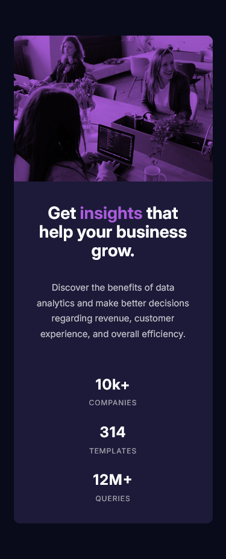

# Frontend Mentor - Stats preview card component solution

This is a solution to the [Stats preview card component challenge on Frontend Mentor](https://www.frontendmentor.io/challenges/stats-preview-card-component-8JqbgoU62). Frontend Mentor challenges help you improve your coding skills by building realistic projects. 

## Table of contents

- [Overview](#overview)
  - [The challenge](#the-challenge)
  - [Screenshot](#screenshot)
  - [Links](#links)
- [My process](#my-process)
  - [Built with](#built-with)
  - [What I learned](#what-i-learned)
  - [Continued development](#continued-development)
  - [Useful resources](#useful-resources)
- [Author](#author)

## Overview

### Screenshot

### Links

- Solution URL: (https://github.com/dansuda/stats-preview-card-component-main)
- Live Site URL: (https://dansuda.github.io/stats-preview-card-component-main)

## My process

### Built with

- Semantic HTML5 markup
- CSS custom properties
- CSS Flexbox
- SASS/SCSS [https://sass-lang.com/]
- Mobile first workflow

### What I learned

I learned more about Flexbox and its different uses within the parent-children relationships.
I also learned about position relative and absolute and their roles in stacking or layering elements on top of each other, in this case to give the monochromatic image a purple-ish overlay.
A challenge I faced was trying to figure out how the overlay color was applied to the image. Was it blending, or transparency/opacity, or another technique I'm completely unaware of?
Another challenge was getting the image to fill its parent div in the desktop version. I ended up using `height: 100%;` which I know stretches the image but I'm lucky enough that it doesn't stretch too much to make it look bad. What technique should I have used?

### Continued development

I think I'm growing in my abilities and being comfortable with html and css code in a healthy pace, so I expect to go into javascript soon!

### Useful resources

- (https://www.w3schools.com) - This helped me to understand how to use various css rules and how important they are. 
- (https://www.stackoverflow.com) - This is an amazing website which has really old questions but are still relevant to people like me today who seem to have joined this bandwagon very late. It's nice and helpful they've been around for so long.

## Author

- Github - [dansuda](https://www.github.com/dansuda)
- Frontend Mentor - [@dansuda](https://www.frontendmentor.io/profile/dansuda)